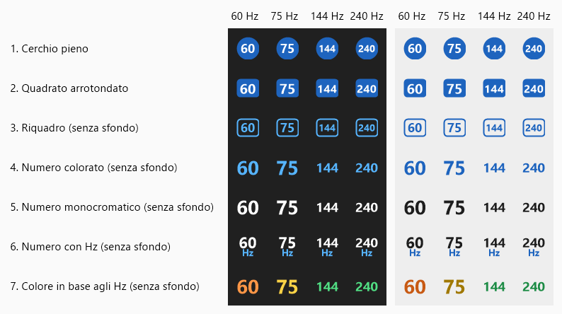

# RefreshSwitch

English | [Italiano](README.it.md)

A Windows tray app to change the refresh rate (Hz) of all your monitors, and to turn monitors off without unplugging them.

- **Change refresh rate by clicking the icon** (off by default): when enabled in the menu, a left-click switches to the next refresh rate on all monitors; the menu stays available with a right-click
- **Click** the tray icon (left or right) to open the menu: pick a rate for all monitors or for a single monitor, turn screens off, disable/re-enable a monitor, Start with Windows, Exit
- The icon shows the Hz of the primary monitor; the tooltip lists all monitors
- Monitors are shown with their real model name, plus the display number
- No administrator rights required
- The UI language follows Windows (Italian or English)

If a monitor does not support the requested rate, the closest one available at its current resolution is used.

## Who it is for

I recommend RefreshSwitch to anyone who needs to disconnect a monitor as if the cable were physically unplugged, without touching it.

One example is watching Netflix in 4K from Microsoft Edge (a browser extension is required): a second screen attached to the PC can get in the way, and the usual fix is to unplug it. With **Disable [monitor]** the screen leaves the desktop the same way, and **Re-enable all monitors** brings it back when you are done.

It is also handy if you often change refresh rate, for example a high rate for games and a lower one to save power or to match a video.

## Turning monitors off

- **Turn screens off**: puts all monitors in standby; moving the mouse or pressing a key wakes them.
- **Disable [monitor]**: detaches the monitor from the desktop, like unplugging the cable (windows move to the other screens). The last active monitor cannot be disabled.
- **Re-enable all monitors (Extend)**: does the same as "Extend these displays" in Windows settings, so every connected monitor comes back with the layout Windows remembers.

## Icon styles

Ten styles, selectable from the menu, shown here on a dark and a light taskbar. The monochrome ones follow the Windows theme. The gothic numbers are drawn by the app itself (a calligraphy nib swept along each digit).



Errors are logged to `%LOCALAPPDATA%\RefreshSwitch\error.log`.

## Build

```
C:\Windows\Microsoft.NET\Framework64\v4.0.30319\csc.exe -nologo -target:winexe -out:RefreshSwitch.exe -r:System.Windows.Forms.dll -r:System.Drawing.dll -r:System.Management.dll RefreshSwitch.cs Gothic.cs
```
